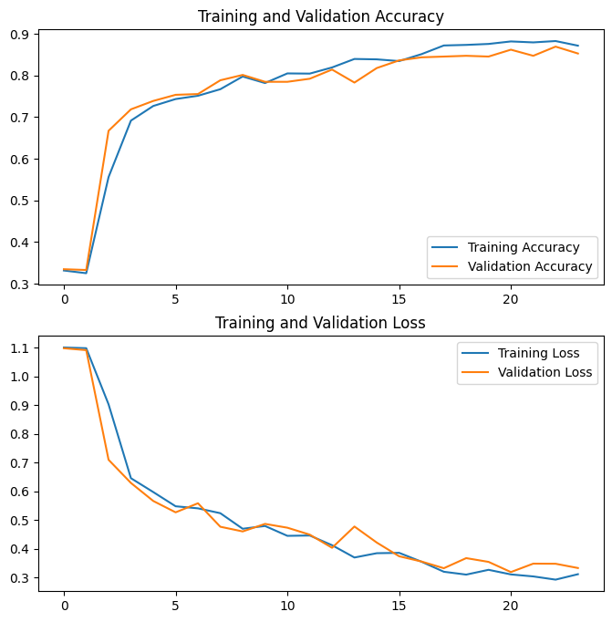
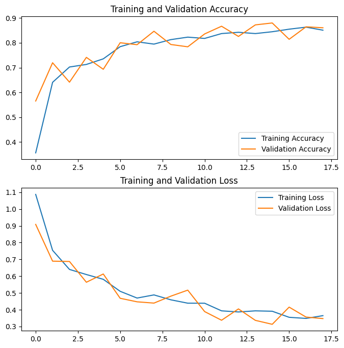
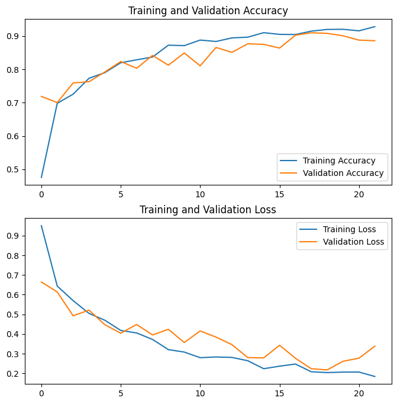

# assignment2

## Content
1. Introduction
2. Data Description
3. CNN Models
4. Transfer Learning Models
5. Comparing Results
6. Conclusions
7. References

## 1. Introduction

## 2. Data Description
[Lungs](./visuals/lungs.png)

## 3. CNN Models
We created three CNN models, with varying architectures. The loss and accuracy plots for each can be seen below. We referenced papers doing similar work with image classification in order to build these custom CNNs, while adhering to the 12 layer minimum. The first CNN model is separated into convolution blocks of two layers each, with two blocks or 32 filters (4 total layers), two of 128 filters, and two of 512 filters, each using relu activation and separated by a max pooling layer. The goal was to create a basic model to build off of, with the filter number increasing, while also not needing too much computational power. The Max pooling layers allow for the model to reduce complexity, then end using soft max to classify the image.

The second model was based on the [paper](https://www.nature.com/articles/s41598-023-37743-4). This model is more detailed, using 13 layers and different block sizes. The first convulsion block has two layers with 64 filters each, the second block two layers with 128 filters, the third block three layers with 256 filters, then the fourth and fifth block both have 3 layers with 512 filters each. Each of these blocks are followed by a max pooling layer, and then a final flattening layer. This new architecture increased complexity with more varying filter sizes, different block sizes, and an additional layer. Additionally, by relying on past literature for this model, it adds a level of validity knowing that other researchers have also trusted a similar model.

We used the 3 techniques — ReduceLROnPlateau, ModelCheckpoint, and EarlyStopping — to prevent overfitting. ReduceLROnPlateau was chosen to adjust the learning rate based on validation loss, which is particularly relevant here as this is complex dataset and it is important to avoid getting stuck in a local minima. ModelCheckpoint was used to save the best model throughout based on validation accuracy, which proved important as with some epochs the model did not improve. Lastly, we used EarlyStopping to prevent against overfitting, allowing there to be 3 epochs with no improved validation loss before stopping the model. Most of the models stopped before reaching. These were all effective, and the accuracy and loss plots show there was no overfitting in the model.

For the learning rate, we tried a range of values and landed with the default of 0.001. The training and validation curves show that the chosen learning rate enabled a stable convergence without causing instability or divergence. Additionally, ReduceLROnPlateau allowed for some flexibility in the learning rate. For batch size, 32 was chosen to be computationally efficient, but also small enough to still provide some complexity. The number of epochs varied based on EarlyStopping, but we initally started with 30 epochs. If the model reached this number before stopping, it would not take Colab too long to handle. However, most of the models stopped somehwere aronud 15 epochs, as if they continued, we would have risked overfitting the model.

For training our CNN model, we chose to stick with the categorical cross-entropy loss function and the Adam optimizer (but now with an assigned learning rate). The categorical cross-entropy is well suited for classifications problems like this as it measures the difference between predicted probability distribution and the actual distribution of the target classes. So, we are able to learn how much accuracy is lost. As for the Adam optimizer, it is one of the most popular and its flexibility was fitting. We initialized it with a learning rate of 0.001.

A significant challenge was figuring out how create a complex model that Google Colab could handle, that was justifiable. This took a lot of research into similar studies that created their own CNN models, without having too many layers were it would be impossible for our needs, nor too few were it would not reach the 12 layer minimum. We were able to find relevant models that we could build off of. However, a larger issue was our computing power. We could not fine tune the models and play around with the numbers as much as I would have liked because the computing time took too long, and Colab would often run out of GPU.

|Model|Summary Plot|
|:-:|:-:|
|First CNN|
|Second CNN|
|Third CNN|

## 4. Transfer Learning Models
We created two transfer learning models, using ResNet50 and InceptionV3 respectively. The InceptionV3 model was originally trained on the ImageNet dataset, which consists of millions of images across thousands of classes. It has learned features that are useful for a wide range of visual recognition tasks. The ResNet50 model was also trained on the ImageNet dataset, with a focus on improving the training of very deep networks.

Among the models, the one with the fastest convergence upon fine-tuning was the InceptionV3 model. This could be due to the depth and architecture of the InceptionV3 model, which might have captured more abstract and generalized features that are beneficial for the target task. It also has fewer parameters than ResNet50, which could potentially lead to faster convergence, especially with a relatively small dataset. Finally, as ResNet50 was specifically designed to address the vanishing gradient problem encountered in very deep network, this can sometimes result in slower convergence during fine-tuning compared to models like InceptionV3, which may not encounter as severe gradient vanishing issues.

In the fine-tuning process, we added custom classification layers on top of the base models. We first froze all layers of the pre-trained models to prevent their weights from being updated during training. We then unfroze the last 30 layers of the base models for fine-tuning, allowing them to adapt to the specific features of the new dataset while retaining the learned features from ImageNet. The total number of parameters in the InceptionV3 model is 22.6 million, 6 million trainable and 16.6 million non-trainable. For the ResNet50 model, there are 24.3 million parameters, 15.2 million trainable and 9.1 million non-trainable.

The performance of the Transfer Learning model - specifically the InceptionV3 model - was on par with that of the first CNN model. Transfer Learning leverages pre-trained models' knowledge and features learned from a large dataset like ImageNet, which can be beneficial for tasks with limited data. Fine-tuning allows the model to adapt its features to the specific nuances of the target dataset, potentially leading to improved performance compared to directly using the pre-trained model's features. The advantage of transfer learning lies in its ability to save training time and resources, especially when working with limited datasets. However, a potential limitation could be the transferability of features from the pre-trained model to the target task, which may not always align perfectly.

The most challenging part for us was determining the extent of fine-tuning, i.e. which layers to freeze and which ones to unfreeze. We decided to freeze most of the layers of the modesl as most of the lower layers capture more generic features like edges and textures, which might be useful across various tasks. Conversely, higher layers capture more task-specific features, which we wanted to adapt to the new dataset through fine-tuning. Experimentation and monitoring model performance helped in making this decision, as it allowed us to observe how different fine-tuning strategies affected convergence and performance on the validation set.

|Model|Summary Plot|
|:-:|:-:|
|ResNet50|
|InceptionV3|

## 5. Comparing Results
|Model|Accuracy|Loss|Precision|Recall|
|:-:|:-:|:-:|:-:|:-:|
|CNN-1 | 0.905500 | 0.264102 |  0.907956 | 0.901627|
|CNN-2 | 0.781565 | 0.539377 |  0.786911 | 0.763749|
|CNN-3 | 0.920217 | 0.218900 |  0.920155 | 0.919442|
|INCEPTIONV3 | 0.896204 | 0.246407 |  0.899376 | 0.893106|
|RESNET50 | 0.755229 | 0.540496 |  0.765032 | 0.749032|

The table above shows the accuracy, loss, precision, and recall values for our final five models on the test data. The latest model, CNN-3, which had fewer layers than the previous, preformed better than all the models, across all the metrics. It has a test accuracy, precision, and recall of about 92% and loss of only 0.219. Although we expected the more complex models to outperform this simler CNN, this outcome may be because for this data, not as much complexity was needed. Further, the essential features of the data were still being captured well by this less complex model. Still, the first CNN model was close, with test accuracy, precision, and recall all around 90%. The Inception3 model was close behind at about 89% for those metrics, and a sllightly smaller loss value than the first CNN model. 

## 6. Conclusions
We were able to effectively use machine learning methods to predict whether X-ray images of lungs were normal, had COVID-19, or had pneumonia. We did this by by preprocessing the data, then created 3 separate CNN models from scratch, and 2 transfer learning models (ResNet50 and InceptionV3). As discussed above, our final CNN model, which also happened to be the simplest, performed the best.

Before we performed an additional split for the trained datasets and used the test sets for validation in training, we found that the more complex CNN models, as well as the transfer learning models, performed better than they did after we created a new validation set. This indicates to us that the validation split upon the training set which reduced the volume of training data was impacting the complex models' performance in a way that the simpler CNN model was not impacted as much by. If we were to continue experimenting with models, we would want to augment more training images to increase our dataset for the complex models to pick up meaningful patterns.

## 7. References
Dataset: M.E.H. Chowdhury, T. Rahman, A. Khandakar, R. Mazhar, M.A. Kadir, Z.B. Mahbub, K.R. Islam, M.S. Khan, A. Iqbal, N. Al-Emadi, M.B.I. Reaz, “Can AI help in screening Viral and COVID-19 pneumonia?” arXiv preprint, 29 March 2020. [link](https://arxiv.org/abs/2003.13145). 

CNN Model: Dumakude, A., Ezugwu, A.E. Automated COVID-19 detection with convolutional neural networks. Sci Rep 13, 10607 (2023). [link](https://doi.org/10.1038/s41598-023-37743-4).
